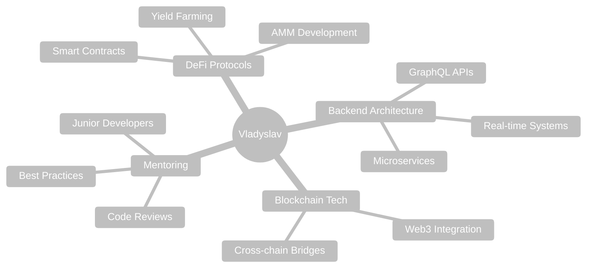

# 👋 Hi there, I'm Vladyslav!

<div align="center">
  
  <!-- Typing Animation -->
  [](https://git.io/typing-svg)

  <!-- Wave Animation -->
  
  
  <!-- Profile Views Counter -->
  
  
</div>

---

## 🌟 About Me

```typescript
const vladyslav = {
  code: ["TypeScript", "JavaScript", "Solidity", "Go"],
  technologies: {
    backend: ["Node.js", "NestJS", "Express", "GraphQL"],
    frontend: ["React", "Next.js", "Vue.js", "Nuxt"],
    blockchain: ["Web3.js", "Ethers.js", "Smart Contracts", "DeFi"],
    databases: ["PostgreSQL", "MongoDB", "Redis"],
    devOps: ["Docker", "AWS", "CI/CD", "GitHub Actions"],
  },
  currentFocus: "Building next-gen DeFi protocols",
  location: "Poland 🇵🇱",
  funFact: "I can turn coffee into code ☕➡️💻"
};
```

---

<div align="center">

## 🛠️ Technologies & Tools

<!-- Animated Tech Stack -->

<br/>


<!-- Custom Animated Badges -->
<p>
  
  
  
  
  
  
</p>

</div>

---

## 📊 GitHub Statistics

<div align="center">
  
  <!-- GitHub Stats Card -->
  
  
  <!-- Most Used Languages -->
  

</div>

<div align="center">

  <!-- Streak Stats -->
  

</div>

---

## 🐍 Contribution Snake Animation

<div align="center">

  <!-- Snake Animation -->
  <picture>
    <source media="(prefers-color-scheme: dark)" srcset="https://raw.githubusercontent.com/Aciila/Aciila/output/github-contribution-grid-snake-dark.svg">
    <source media="(prefers-color-scheme: light)" srcset="https://raw.githubusercontent.com/Aciila/Aciila/output/github-contribution-grid-snake.svg">
    
  </picture>

</div>

---

## 🏆 GitHub Trophies

<div align="center">
  
  

</div>

---

## 🎯 Current Focus

<div align="center">



</div>

---

## 🌐 Let's Connect!

<div align="center">

[](https://linkedin.com/in/vladyslav-buzhenko-a595311a8)
[](https://Aciila.github.io)
[](mailto:vlad.byjik@gmail.com)

<!-- Animated Contact Info -->
<p>
  <a href="https://linkedin.com/in/vladyslav-buzhenko-a595311a8">
    
  </a>
  <a href="mailto:vlad.byjik@gmail.com">
    
  </a>
</p>

</div>

---

## 📈 Activity Graph

<div align="center">

<!-- Activity Graph -->
[](https://github.com/ashutosh00710/github-readme-activity-graph)

</div>

---

<div align="center">

## 💭 Random Dev Quote


---

## 🎮 When I'm not coding...


- 🔗 Exploring new blockchain protocols
- 🌱 Learning cutting-edge Web3 technologies  
- 📚 Reading about DeFi innovations
- 🏃‍♂️ Staying active and healthy
- 🌍 Traveling and meeting new people

<br clear="right"/>

---

<details>
<summary>📊 Detailed Statistics</summary>
<br>

<!-- Detailed GitHub Stats -->


<!-- Contribution Stats -->


</details>

---


<!-- GitHub Metrics -->
<div align="center">


</div>

---

<div align="center">

**⭐️ Thanks for visiting! ⭐️**


</div>
